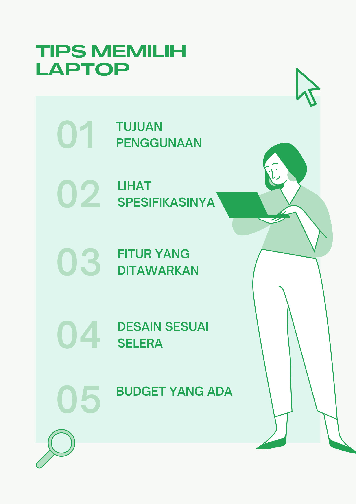
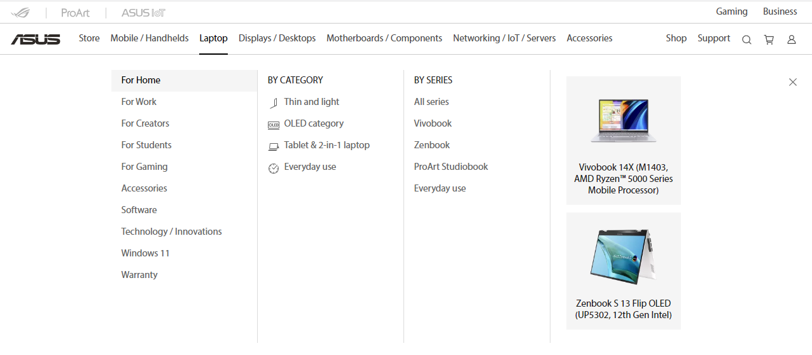

## Bagaimana Cara Memilih Laptop?
Memilih sebuah laptop tentu tidak bisa dengan sembarangan hanya berdasarkan keinginan atau mengikuti gengsi. Setidaknya dalam pandangan saya ada beberapa hal yang bisa menjadi pertimbangan dalam memilih laptop.

1. Tujuan Penggunaan
Yang pertama tentukan dahulu penggunaannya untuk tujuan apa. Apakah untuk sekolah? bekerja? editing? gaming? atau yang lainnya. Jadi laptop benar-benar berfungsi sebagaimana mestinya.

2. Lihat Spesifikasinya
Selanjutnya cek spesifikasinya. Jika untuk sekolah atau bekerja, tidak perlu menggunakan laptop dengan spesifikasi _high_ _end_. Dengan spesifikasi standar saja sudah cukup agar nantinya tidak mubadzir sehingga potensi laptop benar-benar terpakai.

3. Fitur apa saja yang ditawarkan
Apakah fitur yang ditawarkan memenuhi kebutuhan. Misalkan seorang _streamer_ tentu membutuhkan laptop dengan webcam yang mumpuni, _port_ untuk alat penunjang yang banyak, kualitas audio yang baik, dll.

4. Desain Sesuai Selera
Desain juga bisa menjadi pertimbangan berikutnya, alasannya? fleksibilitas. Bagi orang kantoran atau siapapun yang sering melakukan pekerjaan secara _mobile_, laptop dengan desain minimalis, _compact_, dan tidak berat akan sangat cocok digunakan.

5. Budget yang ada
Yang terakhir budget. Sesuaikan saja budget yang ada, tidak perlu menuntut lebih untuk mengikuti gengsi. Asalkan laptop yang akan dibeli sudah memenuhi kebutuhan, saya rasa itu sudah cukup.

Nah itu tips dari saya tentang bagaimana cara memilih laptop. Pada intinya semua disesuaikan dengan kebutuhan kita.

### Menjatuhkan Pilihan untuk Menggunakan Laptop Asus
Setelah beberapa hari browsing membandingkan berbagai macam merek laptop sampai pusing karena bingung memilihnya, pada akhirnya saya memantapkan diri menjatuhkan pilihan pada Laptop Asus yang kedepannya akan saya beli.

>Kenapa Asus? 🤔

Karena Laptop ASUS hadir dengan dilengkapi Windows 11 Home. Ketika pekerjaan mulai menumpuk, laptop ASUS dengan Windows 11 -nya siap membantu menyelesaikannya. Laptop ASUS dengan Windows 11 yang lebih nyaman di mata, memungkinkan untuk mengekspresikan diri dan cara kerja terbaik. Dan tidak hanya Windows 11 asli, tersedia juga genuine Microsoft Office 2021 untuk menunjang aktivitas Kamu sepanjang hari.

Disamping itu juga, Asus menawarkan berbagai macam jenis laptop yang peruntukkannya sudah disesuaikan. Ketika membuka websitenya ada 5 pilihan yang bisa kamu pilih sesuai dengan kebutuhan. Untuk rumah, untuk bekerja, untuk pelajar, untuk _creator_, dan untuk gaming. Nah tinggal pilih dong hehehe.. 😁

### _Kesengsem_ Asus Zenbook Duo Oled
